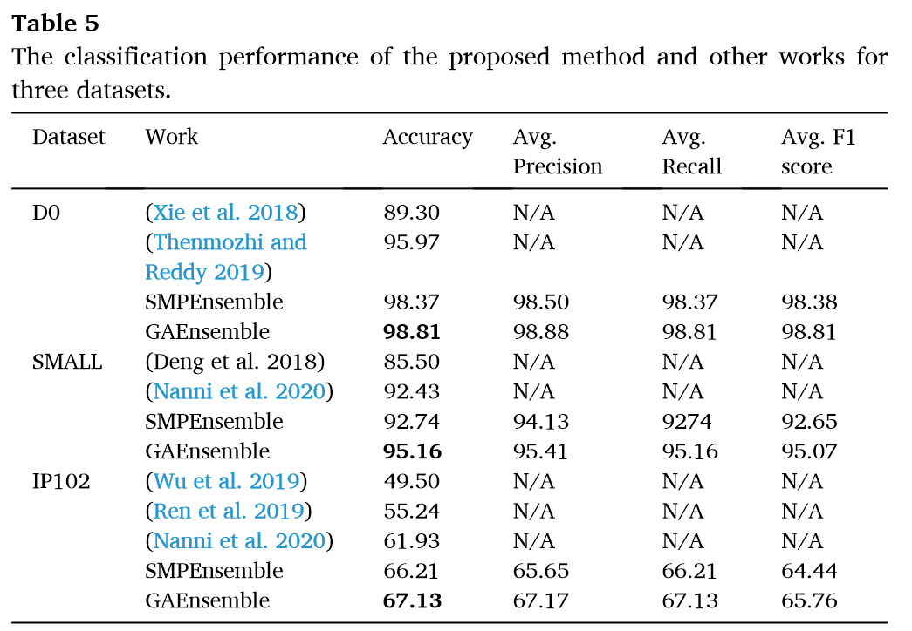
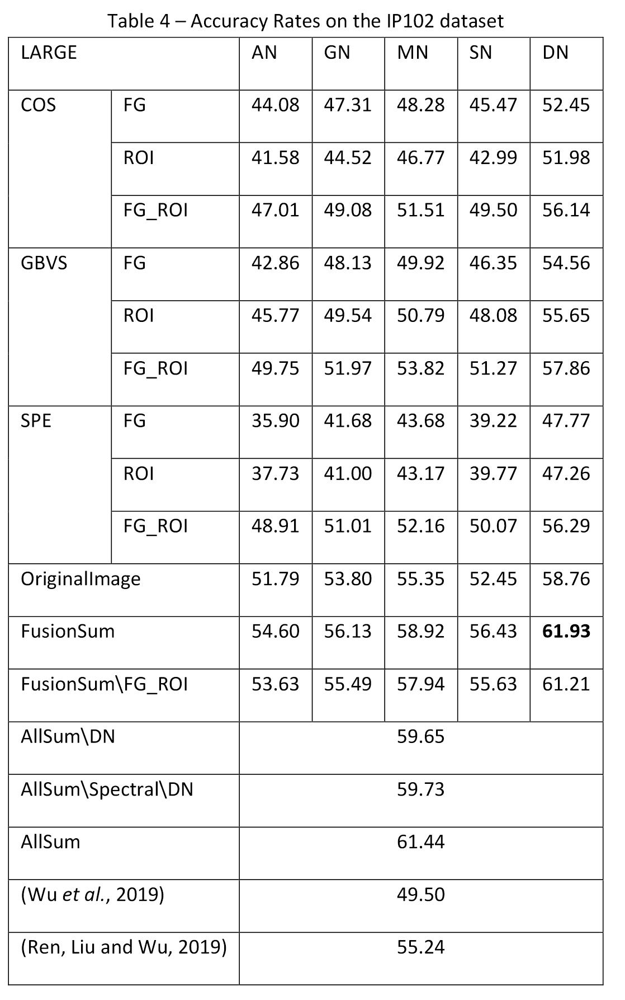
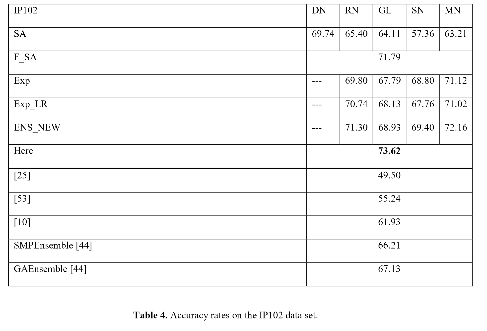
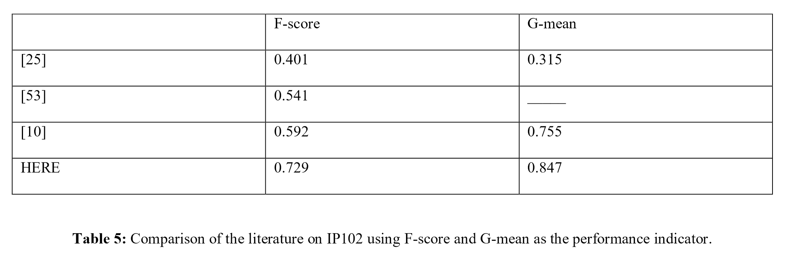
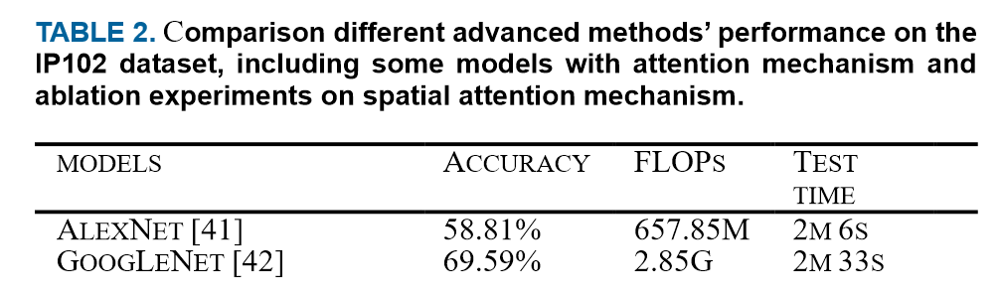
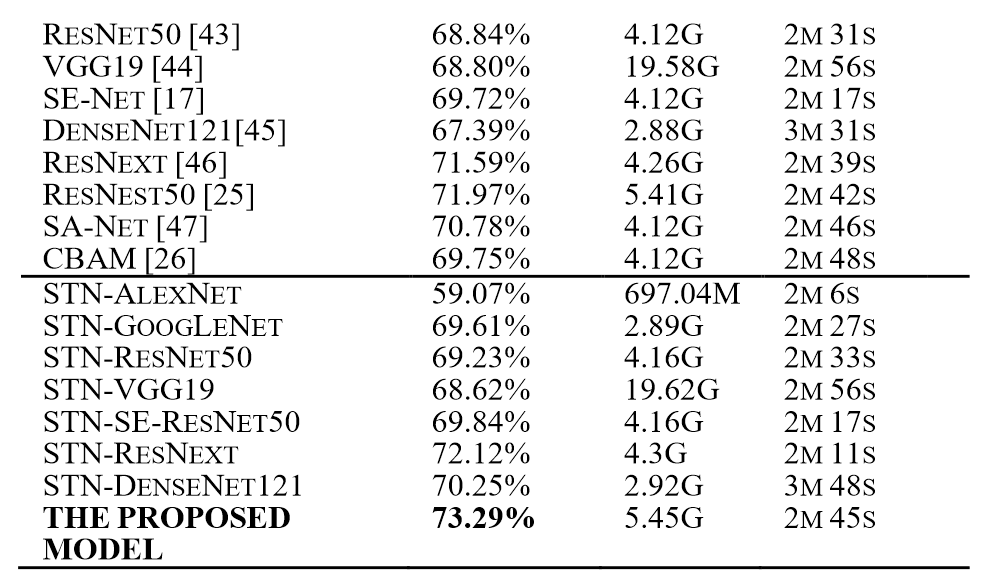
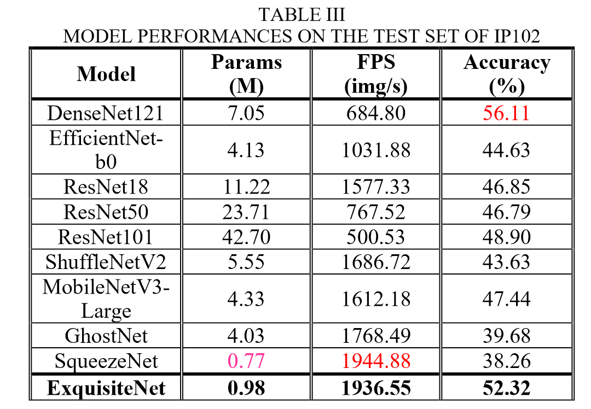
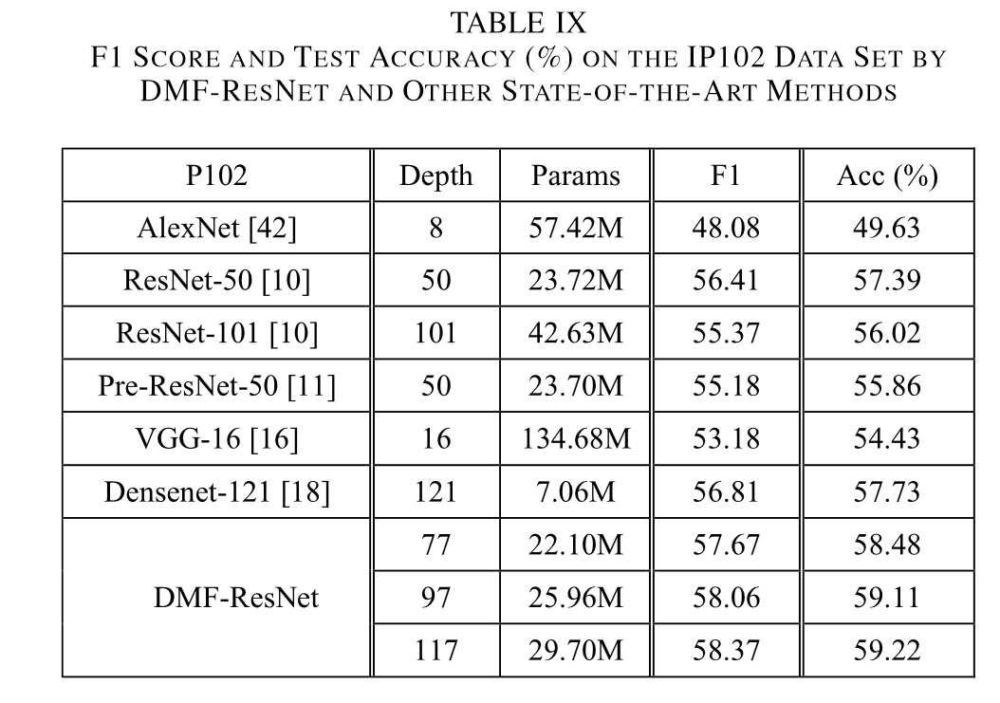

## [Ip102：害虫识别的大规模基准数据集](https://scholar.google.com.hk/scholar?cluster=4487446333535453318&hl=zh-CN&as_sdt=2005&sciodt=0,5) 被引论文 209 （截止至2023年6月30日15:05:59）

下面列出了IP102一部分被引论文, 标题是自动翻译的, 给出了doi可以自行查看. 
**小结:** 比较可靠的结论是(2021 三区) 在IP102上做到了73.29% 的ACC, 一部分用集成学习(+显著性检测)做的研究都在(60%~75%之间);一些基础模型做到了80%左右ACC的论文感觉可信程度比较低.  一篇通过迁移学习+微调+数据增强做到了86.95%也存疑,实验做的不是很严谨. 可以推进的一些点: 轻量化(新模型), 数据增强, 迁移学习, 集成学习(比较常见的做法), 部署加速(量化剪枝…), 目标检测(任务做的更少) 
p.s. : 老师说一些来自MDPI的论文就别看了...我看了一下确实质量一般...

1. [引用数 296] 2021  5.827\|Q1\|2区 \| [Plant diseases and pests detection based on deep learning: a review](https://link.springer.com/article/10.1186/s13007-021-00722-9)  基于深度学习的植物病虫害检测：综述

    > 摘要：植物病虫害是决定植物产量和品质的重要因素。通过数字图像处理可以进行植物病虫害识别。近年来，深度学习在数字图像处理领域取得了突破，远远优于传统方法。如何利用深度学习技术来研究植物病虫害识别已成为研究者非常关注的研究问题。本文对植物病虫害检测问题进行了定义，并提出了与传统植物病虫害检测方法的比较。根据网络结构的差异，本研究从分类网络、分类网络三个方面概述了近年来基于深度学习的植物病虫害检测研究。检测网络和分割网络，并总结了每种方法的优缺点。介绍了常见的数据集，并对现有研究的表现进行了比较。在此基础上，本研究探讨了基于深度学习的植物病虫害检测实际应用中可能面临的挑战。此外，针对挑战提出了可能的解决方案和研究思路，并给出了几点建议。最后，本研究对基于深度学习的植物病虫害检测的未来趋势进行了分析和展望。本研究讨论了基于深度学习的植物病虫害检测实际应用中可能面临的挑战。此外，针对挑战提出了可能的解决方案和研究思路，并给出了几点建议。最后，本研究对基于深度学习的植物病虫害检测的未来趋势进行了分析和展望。本研究讨论了基于深度学习的植物病虫害检测实际应用中可能面临的挑战。此外，针对挑战提出了可能的解决方案和研究思路，并给出了几点建议。最后，本研究对基于深度学习的植物病虫害检测的未来趋势进行了分析和展望。

2. [引用数 37] 使用深度学习对现场图像中的昆虫进行分类和检测以实现智能害虫管理：系统评价 https://doi.org/10.1016/j.ecoinf.2021.101460  

3. [引用数 189] 2021 综合性顶刊 PNAS | 深度学习和计算机视觉将改变昆虫学https://doi.org/10.1073/pnas.2002545117

    > 地球上的大多数动物物种都是昆虫，最近的报告表明它们的数量正在急剧下降。尽管这些报告来自广泛的昆虫类群和地区，但评估这一现象程度的证据却很少。昆虫种群的研究具有挑战性，大多数监测方法都是劳动密集型且低效的。计算机视觉和深度学习的进步为这一全球挑战提供了潜在的新解决方案。相机和其他传感器可以在整个昼夜和季节周期中有效、连续、无创地进行昆虫学观察。标本的物理外观也可以通过实验室的自动成像来捕获。当对这些数据进行训练时，深度学习模型可以提供昆虫丰度、生物量和多样性的估计。更远，深度学习模型可以量化表型特征、行为和相互作用的变化。在这里，我们将深度学习和计算机视觉的最新发展与对昆虫和其他无脊椎动物进行更具成本效益的监测的迫切需求联系起来。我们提供基于传感器的昆虫监测示例。我们展示了如何将深度学习工具应用于异常大的数据集以获取生态信息，并讨论在昆虫学中实施此类解决方案所面临的挑战。我们确定了四个重点领域，这将促进这一转变：1）基于图像的分类识别的验证；2）生成足够的训练数据；3）开发公共的、精选的参考数据库；4）集成深度学习和分子工具的解决方案。

    > 当昆虫生活在其自然环境中时，分类准确性通常要低得多（82，83），但是当物种水平的类别置信度较低时，仍然可以自信地将昆虫分类到更粗糙的分类分辨率（84）。 
    >然而，为了实现基于深度学习的识别，还需要来自昆虫学研究和监测的单个开放数据集（例如，参考文献82，93和108）。

4. [引用数 55]具有高阶池化表示的空间特征增强注意神经网络在病虫害识别中的应用https://doi.org/10.3390/agriculture12040500

    >  随着先进信息化、智能化技术的发展，精准农业已成为农作物病虫害监测和防治的有效解决方案。然而，精准农业应用中的病虫害识别本质上是细粒度的图像分类任务，其目的是学习有效的判别特征，能够识别相似视觉样本之间的细微差异。解决现有标准模型参数过大、精度性能低的问题仍然具有挑战性。因此，在本文中，我们提出了一种特征增强的注意力神经网络（Fe-Net）来处理创新农艺实践中作物病虫害的细粒度图像识别。该模型是基于改进的CSP级骨干网络建立的，它提供了各种尺寸和尺寸的大量通道混洗功能。然后，添加空间特征增强注意模块以利用不同语义区域之间的空间相互关系。最后，所提出的 Fe-Net 采用高阶池化模块，通过计算元素协方差矩阵的平方根来挖掘更具代表性的特征。整个架构以端到端的方式进行有效的训练，无需额外的操作。通过在 CropDP-181 数据集上的对比实验，所提出的 Fe-Net 实现了 所提出的 Fe-Net 采用高阶池化模块，通过计算元素协方差矩阵的平方根来挖掘更具代表性的特征。整个架构以端到端的方式进行有效的训练，无需额外的操作。通过在 CropDP-181 数据集上的对比实验，所提出的 Fe-Net 实现了 所提出的 Fe-Net 采用高阶池化模块，通过计算元素协方差矩阵的平方根来挖掘更具代表性的特征。整个架构以端到端的方式进行有效的训练，无需额外的操作。通过在 CropDP-181 数据集上的对比实验，所提出的 Fe-Net 实现了*Top-1 准确率*高达 85.29%，平均识别时间仅为 71 ms，优于其他现有方法。更多的实验证据表明，我们的方法在模型的性能和参数之间取得了平衡，适合其在精准农业艺术应用中的实际部署。
    >
    > 关键词：[精准农业](https://www.mdpi.com/search?q=precision+agriculture)；[农作物病虫害](https://www.mdpi.com/search?q=crop+pests+and+diseases)；[细粒度的视觉分类](https://www.mdpi.com/search?q=fine-grained+visual+classification)；[特征增强注意力机制](https://www.mdpi.com/search?q=feature-enhanced+attention+mechanism)；[高阶池化模块](https://www.mdpi.com/search?q=higher-order+pooling+module)

5. [引用数 77]植物病害识别的半监督少样本学习方法https://link.springer.com/article/10.1186/s13007-021-00770-1 

    > 背景  从少量样本中学习自动识别植物叶片病害对于保护农业产量和质量来说是一项有吸引力且有前景的研究。现有的农业小样本分类研究主要基于监督学习方案，忽略了未标记数据的有用信息。
    > 方法  在本文中，我们提出了一种半监督的少样本学习方法来解决植物叶片疾病的识别。具体来说，使用公共 PlantVillage 数据集并将其分为源域和目标域。考虑域分割和少样本参数（N-way、k-shot）进行了广泛的比较实验，以验证所提出的半监督少样本方法的正确性和泛化性。在半监督过程中选择伪标记样本方面，我们采用置信区间自适应地确定伪标记未标记样本的数量。
    > 结果  单一半监督方法的平均改进为2.8%，迭代半监督方法的平均改进为4.6%。
    > 结论  所提出的方法可以在标记训练数据较少的情况下胜过其他相关工作

6. [引用数 98]云计算系统中深度学习农业害虫识别的新型移动应用https://doi.org/10.1016/j.aej.2021.03.009  

    > 据粮食及农业组织 (FAO) 报告，农业害虫每年导致全球农作物产量损失 20% 至 40%。因此，智慧农业为农民应用[人工智能技术](https://www.sciencedirect.com/topics/engineering/artificial-intelligence-technique)[与现代信息通信技术](https://www.sciencedirect.com/topics/engineering/information-and-communication-technologies)相结合来消除这些有害害虫提供了最佳选择。因此，可以提高农作物的生产力。因此，本文介绍了一种新的移动应用程序，使用深度学习解决方案自动对害虫进行分类，为专家和农民提供支持。开发的应用程序利用更快的基于区域的[卷积神经网络](https://www.sciencedirect.com/topics/engineering/convolutional-neural-network)（Faster R-CNN）完成基于云计算的害虫识别任务。此外，推荐农药的数据库与检测到的农作物害虫相关联，以指导农民。这项研究已在五组害虫上成功得到验证；称为蚜虫、蝉科、亚麻芽虫、跳蚤甲虫和红蜘蛛。所提出的 Faster R-CNN 对所有测试的害虫图像显示出 99.0% 的最高准确识别结果。此外，我们的[深度学习](https://www.sciencedirect.com/topics/engineering/deep-learning)方法优于以前的其他识别方法，即单次多框检测器（SSD）MobileNet 和传统的[引用数 反向传播](https://www.sciencedirect.com/topics/engineering/backpropagation)（BP）神经网络。本研究的主要前景是实现我们开发的农业害虫在线识别应用程序，无论是在大型农场还是针对特定作物的温室等露天场所。

7. [引用数 143]用于小数据集云图像补丁分类的卷积神经网络高精度模型平均集成https://doi.org/10.3390/app9214500

    > 云的研究对天空科学及相关应用有着巨大的影响，而云的分类在其中起着至关重要的作用。已经进行了大量研究，其中包括传统的机器学习方法和深度学习方法。与传统的机器学习方法相比，深度学习方法取得了更好的效果。然而，由于参数数量众多，大多数深度学习模型需要大量数据来训练。因此，在小数据集的情况下，他们无法获得高精度。在本文中，我们提出了一个完整的解决方案，用于在小数据集上对云图像块进行高精度分类。首先，我们为小数据集设计了合适的卷积神经网络（CNN）模型。第二，我们应用正则化技术来提高泛化能力并避免模型的过度拟合。最后，我们引入模型平均集成来减少预测方差并提高分类精度。我们在新加坡全天空成像类别（SWIMCAT）数据集上对所提出的解决方案进行了实验，该数据集展示了大多数类别的完美分类精度，并证实了所提出模型的鲁棒性。
    >
    > 关键词：[云分类](https://www.mdpi.com/search?q=cloud+classification)；[美国有线电视新闻网](https://www.mdpi.com/search?q=CNN)；[集成模型](https://www.mdpi.com/search?q=ensemble+model)；[SWIMCAT数据集](https://www.mdpi.com/search?q=SWIMCAT+dataset)

8. [引用数 91] 2020 6.757\|Q1\|1区 \| 使用基于遗传算法的深度卷积神经网络加权集成进行作物害虫分类https://doi.org/10.1016/j.compag.2020.105809

    > 昆虫是造成水稻、小麦、玉米、大豆、甘蔗、鹰嘴豆、马铃薯等农作物重大损失的重要原因之一。早期识别昆虫种类至关重要，以便采取必要的预防措施将损失保持在较低水平。然而，由于昆虫种类相似且知识匮乏，准确识别各类农作物昆虫对农民来说是一项艰巨的任务。为了解决这个问题，可以采用计算机化方法，特别是基于卷积神经网络（CNN）的方法。[由于CNN](https://www.sciencedirect.com/topics/agricultural-and-biological-sciences/neural-network)能够从数据中自动学习与数据相关的特征，因此已成功应用于许多图像分类问题。
    >
    > [在整个研究过程中，使用适当的迁移学习](https://www.sciencedirect.com/topics/computer-science/transfer-learning)和微调策略对七种不同的预训练 CNN 模型（VGG-16、VGG-19、ResNet-50、Inception-V3、Xception、MobileNet、SqueezeNet）进行了修改和重新训练。公开可用的 D0 数据集，包含 40 个类别。后来，性能最好的三个CNN模型Inception-V3、Xception和MobileNet通过最大概率之和策略进行集成以提高分类性能，该模型被命名为SMPEnsemble。之后，使用加权投票对这些模型进行集成。权重由遗传算法确定，考虑了三个CNN模型的成功率和预测稳定性，该模型被命名为GAEnsemble。
    >
    > GAEnsemble 在 D0 数据集上实现了最高的分类准确率 98.81%。为了保持集成模型的鲁棒性，在不改变 D0 上最初表现最佳的 CNN 模型的情况下，使用另外两个数据集重复该过程，例如具有 10 个类别的 SMALL 数据集和具有 102 个类别的 IP102 数据集。GAEnsemble 的 SMALL 数据集的准确度值为 95.15%，IP102 的准确度值为 67.13%。就性能指标而言，与这三个数据集的文献相比，GAEnsemble 都具有竞争力。

    

9. [引用数 29]基于特征聚合增强的图相关高阶神经网络架构用于病虫害识别应用https://doi.org/10.1016/j.compag.2020.105809

    > 病虫害是影响农业生产、粮食安全供应和植物生态多样性的重要威胁因素。然而，对各种病虫害的准确识别对于现有的先进信息和智能技术来说仍然是一个挑战。病虫害识别通常是一个细粒度的视觉分类问题，由于不同类别之间的外部相似性以及同一类别的每个子样本之间的显着差异，很容易混淆传统的粗粒度方法。为此，本文提出了一种有效的具有特征聚合增强功能的图相关高阶网络（GHA-Net）来处理植物病虫害的细粒度图像识别。在我们的方法中，首先形成改进的CSP级骨干网络，以提供多粒度的海量通道混洗功能。其次，依靠多级注意力机制，特征聚合增强模块被设计为利用代表不同区分部分的可区分的细粒度特征。同时，构建图形卷积模块，通过将语义特征正则化到高阶张量空间来分析特定部分相互关系的图相关表示。通过三个模块的协作学习，我们的方法可以掌握病虫害的强大背景细节，以便更好地进行细粒度识别。

10. [引用数 23]SAM 可以分割任何东西吗？当 SAM 遇上伪装物体检测[https://doi.org/10.48550/arXiv.2304.04709](https://doi.org/10.48550/arXiv.2304.04709)  

    > SAM是Meta AI Research最近发布的分割模型，由于其在通用对象分割方面的出色表现而迅速受到关注。然而，其泛化到特定场景（例如伪装场景）的能力仍然未知。伪装物体检测（COD）涉及识别无缝融入周围环境的物体，在医学、艺术和农业等领域有许多实际应用。在本研究中，我们尝试询问 SAM 是否可以解决 COD 任务，并通过采用最大分割评估和伪装位置评估来评估 SAM 在 COD 基准上的性能。我们还将 SAM 的性能与 22 种最先进的 COD 方法进行了比较。我们的结果表明，虽然 SAM 在通用对象分割方面显示出前景，它在 COD 任务上的性能有限。这为进一步研究探索如何构建更强大的 SAM 来解决 COD 任务提供了机会。本文的结果在

11. [引用数 62]植物病害识别：大规模基准数据集以及视觉区域和损失重新加权方法[10.1109/TIP.2021.3049334](https://doi.org/10.1109/TIP.2021.3049334)

      > 植物病害诊断对于农业非常重要，因为它对于提高作物产量非常重要。图像处理的最新进展为我们提供了一种通过视觉植物病害分析解决此问题的新方法。但目前这方面的工作还很少，更谈不上系统的研究。在本文中，我们系统地研究了用于植物病害诊断的视觉植物病害识别问题。与其他类型的图像相比，植物病害图像通常表现出随机分布的病斑、多样的症状和复杂的背景，因此难以捕获判别信息。为了促进植物病害识别研究，我们构建了一个新的大规模植物病害数据集，其中包含 271 个植物病害类别和 220,592 张图像。基于这个数据集，我们通过重新加权视觉区域和损失来强调患病部分来解决植物疾病识别问题。我们首先根据每个图像的聚类分布来计算每个图像中所有划分的图像块的权重，以指示每个图像块的判别级别。然后，我们在弱监督训练期间为每个补丁标签对的每个损失分配权重，以实现区分疾病部分的学习。最后，我们从经过损失重新加权训练的网络中提取补丁特征，并利用 LSTM 网络将加权补丁特征序列编码为综合特征表示。对该数据集和另一个公共数据集的广泛评估证明了所提出方法的优势。

12. [引用数 80]2020 4.498\|Q2\|3区 \| 基于仿生方法的害虫图像检测与识别https://doi.org/10.1016/j.ecoinf.2020.101089  

      > [害虫识别对于](https://www.sciencedirect.com/topics/agricultural-and-biological-sciences/insect-pests)世界许多地区的[作物保护](https://www.sciencedirect.com/topics/agricultural-and-biological-sciences/crop-protection)是必要的。[在本文中，我们提出了一种基于显着性方法和卷积神经网络](https://www.sciencedirect.com/topics/agricultural-and-biological-sciences/neural-network)融合的自动分类器。显着性方法是著名的图像处理算法，可突出显示图像中最相关的像素。在本文中，我们使用三种不同的显着性方法作为图像预处理，并为每种显着性方法创建三个不同的图像。因此，我们为每个原始图像创建 3 × 3 = 9 个新图像来训练不同的卷积[神经网络](https://www.sciencedirect.com/topics/agricultural-and-biological-sciences/neural-network)。我们评估每个预处理/网络对的性能，并且还评估其整体的性能。我们在小型数据集和大型 IP102 数据集上测试了我们的方法。我们最好的集成在较小的数据集 (92.43%) 和 IP102 数据集 (61.93%) 上都达到了最先进的精度，接近人类专家在较小数据集上的表现。此外，我们在以下位置分享我们的 MATLAB 代码：https:[ //github.com/LorisNanni/](https://github.com/LorisNanni/)。

      
    > AN = Alex net; GN=GoogleNet; SN=shuffleNet; MN= mobilenetv2; DN=DenseNet201  
    >   
    > “Cluster-based Saliency Detection (COS)” 
    > “Graph-Based Visual Saliency” 
    > “Spectral Residual (SPE)”
    > “'OriginalImage' shows the results obtained by the CNNs on the original dataset.” 
    > “‘FusionSum’ is the performance of the ensemble created by the same network trained on all the datasets” 
    > “‘AllSum’ is the ensemble created with all the networks trained.” 
   

13. [引用数 5] [元相册：用于少镜头图像分类的多域元数据集](https://proceedings.neurips.cc/paper_files/paper/2022/hash/1585da86b5a3c4fb15520a2b3682051f-Abstract-Datasets_and_Benchmarks.html)

      > 我们引入了 Meta-Album，这是一个图像分类元数据集，旨在促进小样本学习、迁移学习、元学习等任务。它包括 40 个开放数据集，每个数据集至少有 20 个类，每个类有 40 个示例，并具有经过验证的许可证。它们源于不同的领域，例如生态学（动物和植物）、制造（纹理、车辆）、人类行为和光学字符识别，具有各种图像尺度（微观、人体尺度、遥感）。所有数据集均经过统一预处理、注释和格式化，并有 3 个版本（Micro⊂⊂小型的⊂⊂扩展）以匹配用户的计算资源。我们展示了前 30 个数据集在小样本学习问题上的实用性。另外 10 个将在不久后发布。与类似的努力相比，元专辑已经更加多样化和更大（数据集数量），我们致力于通过一系列竞赛不断扩大它。随着比赛的结束，他们的测试数据将被发布，从而创建一个滚动基准，可通过 OpenML.org 获取。我们的网站 https://meta-album.github.io/ 包含挑战获胜方法、基线方法、数据加载器的源代码，以及向我们的可扩展元数据集贡献新数据集或算法的说明。

14. [引用数 36]2022 4.498\|Q2\|3区 \| 用于害虫图像检测的高性能卷积神经网络集成https://doi.org/10.1016/j.ecoinf.2021.101515 

      > [害虫侵扰](https://www.sciencedirect.com/topics/earth-and-planetary-sciences/pest-infestation)是全球农作物受损和收入损失的主要原因。自动识别入侵昆虫将显着加快害虫的识别速度并加快其清除速度。在本文中，我们生成了[CNN集合](https://www.sciencedirect.com/topics/agricultural-and-biological-sciences/neural-network)基于不同的拓扑（EfficientNetB0、ResNet50、GoogleNet、ShuffleNet、MobileNetv2 和 DenseNet201），并使用不同的 Adam 变体进行优化以进行害虫识别。提出了两种基于 DGrad 的深度网络优化的新 Adam 算法，在学习率中引入了缩放因子。优化功能各异的六种 CNN 架构在 Deng (SMALL)、大型 IP102 和 Xie2 (D0) 害虫数据集上进行了训练。使用多个性能指标对集成进行比较和评估。表现最好的集成，结合了[CNN](https://www.sciencedirect.com/topics/agricultural-and-biological-sciences/neural-network)使用不同的 Adam 变体（包括此处提出的新变体），与人类专家在 Deng 数据集上的分类竞争，并在所有三个昆虫数据集上实现了最先进的技术：Deng 为 95.52%，IP102 为 74.11%，IP102 为 99.81%谢2. 对医学图像分类的数据集进行了额外的测试，进一步验证了所提出的 Adam 优化变体的稳健性和功效。所有 MATLAB 源代码均可在 https://github.com/LorisNanni/ 上[获取](https://github.com/LorisNanni)。

      
      
      [25]是ip102原文

15. [引用数 37]2022 8.335\|Q1\|1区 \|深度学习作为生态学和进化的工具 https://doi.org/10.1111/2041-210X.13901 

      > 1. 深度学习正在推动许多日常技术的最新进展，包括语音和图像识别、自然语言处理和自动驾驶。它在生物学领域也越来越受欢迎，已被用于自动物种识别、环境监测、生态建模、行为研究、DNA 测序以及群体遗传学和系统发育学等应用。深度学习依靠人工神经网络进行预测建模，并且擅长识别复杂模式。
      > 2. 在这篇综述中，我们综合了 818 项在生态学和进化论背景下使用深度学习的研究，以提供必要的全学科视角，以促进对该领域推理方法的重新思考。我们介绍了机器学习，并将其与机械推理进行对比，然后简要介绍了深度学习。我们回顾了深度学习在生态学和进化论中的应用，并讨论了其局限性以及克服这些局限性的努力。我们还为有兴趣将深度学习纳入其工具包并确定其未来可能应用的生物学家提供了实用的入门读物。
      > 3. 我们发现深度学习在生态学和进化论领域得到迅速采用，自 2019 年初以来已发表了 589 项研究（64%）。大多数使用卷积神经网络（496 项研究）和监督学习来进行图像识别，也用于使用分子数据的任务、声音、环境数据或视频作为输入。深度学习在生物学中更复杂的应用也开始出现。
      > 4. 在机器学习范式中运行，深度学习可以被视为机械建模的替代方案。它具有良好的性能和随着复杂性的增加而扩展的理想特性，同时提出了独特的挑战，例如对输入数据偏差的敏感性。我们预计深度学习在生态学和进化领域的快速应用将继续下去，特别是在生物多样性监测、发现和遗传数据推断的自动化方面。在不久的将来，可能会更多地使用无监督学习来发现和可视化集群和差距、简化多步骤分析流程以及将机器学习集成到研究生和研究生培训中。

16. [引用数 17 ICCV2021] [超越人类表现的超细粒度视觉分类基准平台](https://openaccess.thecvf.com/content/ICCV2021/html/Yu_Benchmark_Platform_for_Ultra-Fine-Grained_Visual_Categorization_Beyond_Human_Performance_ICCV_2021_paper.html)

      > 深度学习方法在细粒度视觉分类方面取得了显着的成功。然而，这种在下级水平（例如不同的动物或植物物种）的成功分类很大程度上依赖于人类可以观察到的视觉差异，并且基于这种人类视觉观察来标记基本事实。相比之下，很少有人对超细粒度级别的视觉分类进行研究，即在这种粒度下，即使人类专家也很难识别视觉差异，或者还无法通过推断观察到的模式差异来给出肯定的标签。本文报告了我们为缩小这一研究差距所做的努力。我们引入了超细粒度 (UFG) 图像数据集，该数据集包含来自 3,526 个类别的 47,114 张图像。所提出的 UFG 图像数据集中的所有图像均按不同的已确认品种名称分组。此外，我们对所提出的 UFG 图像数据集作为比较基线对最先进的细粒度分类方法进行了广泛的评估。所提出的 UFG 图像数据集和评估协议旨在作为一个基准平台，通过促进人工智能（AI）的基准数据不受标签的限制，可以推进视觉分类研究从接近人类表现到超越人类能力。人类智力（HI）。该数据集可在线获取：https://github.com/XiaohanYu-GU/Ultra-FGVC。我们对提出的 UFG 图像数据集作为比较基线对最先进的细粒度分类方法进行了广泛的评估。所提出的 UFG 图像数据集和评估协议旨在作为一个基准平台，通过促进人工智能（AI）的基准数据不受标签的限制，可以推进视觉分类研究从接近人类表现到超越人类能力。人类智力（HI）。该数据集可在线获取：https://github.com/XiaohanYu-GU/Ultra-FGVC。我们对提出的 UFG 图像数据集作为比较基线对最先进的细粒度分类方法进行了广泛的评估。所提出的 UFG 图像数据集和评估协议旨在作为一个基准平台，通过促进人工智能（AI）的基准数据不受标签的限制，可以推进视觉分类研究从接近人类表现到超越人类能力。人类智力（HI）。该数据集可在线获取：https://github.com/XiaohanYu-GU/Ultra-FGVC。通过促进人工智能（AI）的基准数据不受人类智能（HI）标签的限制。该数据集可在线获取：https://github.com/XiaohanYu-GU/Ultra-FGVC。通过促进人工智能（AI）的基准数据不受人类智能（HI）标签的限制。该数据集可在线获取：https://github.com/XiaohanYu-GU/Ultra-FGVC。

17. [引用数 26]MaskCOV: A random mask covariance network for ultra-fine-grained visual categorization MaskCOV：用于超细粒度视觉分类的随机掩模协方差网络https://doi.org/10.1016/j.patcog.2021.108067

      > 与细粒度视觉分类（FGVC）相比，超细粒度视觉分类（ultra-FGVC）对类别之间具有更相似模式的对象进行分类，例如，粒度范围从分类物种显着下降到对品种内的*品种*[进行](https://www.sciencedirect.com/topics/engineering/granularity)分类。同一物种。它被认为是一个开放的研究问题，主要是由于以下挑战。*首先，图像之间的类间差异按目级别（例如*，同一物种中的品种）比当前 FGVC 任务（*例如*，物种）中的差异小得多。[其次，每个类别只有几个样本，这超出了大多数大型训练数据青睐的卷积神经网络](https://www.sciencedirect.com/topics/engineering/convolutional-neural-network)的能力方法。为了解决这些问题，我们提出了一种新颖的随机掩模协方差网络（MaskCOV），它将辅助自监督学习模块与强大的图像内数据增强方案集成在一起，用于超 FGVC。具体来说，我们首先将输入图像统一划分为补丁，然后通过随机洗牌和屏蔽这些补丁来增强数据。最重要的是，我们引入了一个辅助的自我监督学习模块，用于预测这些补丁的空间协方差上下文，以提高[可辨别性](https://www.sciencedirect.com/topics/computer-science/discriminability)我们的网络进行分类。与最先进的基准相比，所提出的方法的实验结果非常令人鼓舞，证明了 MaskCOV 概念的优越性和潜力，它将研究边界从细粒度视觉分类推进到超细粒度视觉分类。

18. [引用数 37]使用深度学习框架和物联网的远程昆虫陷阱监测系统https://doi.org/10.3390/s20185280

      > 昆虫的早期检测和控制对于建筑环境（人造物理空间，如家庭、酒店、营地、医院、公园、人行道、食品工业等）和农业领域至关重要。目前，此类昆虫控制措施是手动的、繁琐的、不安全的且耗时的依赖于劳动力的任务。随着人工智能 (AI) 和物联网 (IoT) 的最新进步，多项维护任务可以实现自动化，从而显着提高生产力和安全性。这项工作提出了一种使用物联网和深度学习（DL）框架的实时远程昆虫诱捕监测系统和昆虫检测方法。远程陷阱监控系统框架是使用物联网和Faster RCNN（基于区域的卷积神经网络）残差神经网络50（ResNet50）统一目标检测框架构建的。Faster RCNN ResNet 50 对象检测框架使用建筑环境昆虫和农田昆虫图像进行训练，并部署在物联网中。使用四层物联网对所提出的系统进行实时测试，并通过粘性陷阱片捕获建筑环境昆虫图像。此外，通过单独的昆虫图像数据库对农田昆虫进行了测试。实验结果证明，该系统能够自动识别建筑环境昆虫和农田昆虫，平均准确率为94%。Faster RCNN ResNet 50 对象检测框架使用建筑环境昆虫和农田昆虫图像进行训练，并部署在物联网中。使用四层物联网对所提出的系统进行实时测试，并通过粘性陷阱片捕获建筑环境昆虫图像。此外，通过单独的昆虫图像数据库对农田昆虫进行了测试。实验结果证明，该系统能够自动识别建筑环境昆虫和农田昆虫，平均准确率为94%。Faster RCNN ResNet 50 对象检测框架使用建筑环境昆虫和农田昆虫图像进行训练，并部署在物联网中。使用四层物联网对所提出的系统进行实时测试，并通过粘性陷阱片捕获建筑环境昆虫图像。此外，通过单独的昆虫图像数据库对农田昆虫进行了测试。实验结果证明，该系统能够自动识别建筑环境昆虫和农田昆虫，平均准确率为94%。

19. [引用数 43] AgriPest：用于野外实际农业害虫检测的大规模特定领域基准数据集

      > 最近，大量带注释图像的标准数据集的爆炸式增长为深度学习技术在有效和高效的对象检测应用中提供了有希望的机会。然而，由于这些标准化数据集与实际原始数据之间存在巨大的质量差异，如何在实际农业应用中最大限度地利用深度学习技术仍然是一个关键问题。在这里，我们引入了一个名为 AgriPest 的特定领域基准数据集，用于微小野生害虫识别和检测，为研究人员和社区提供了实际野生害虫图像和注释的标准大规模数据集以及评估程序。在过去七年里，AgriPest 捕获了 49 只。通过我们设计的图像采集设备在田间环境中拍摄四种作物（包含 14 种害虫）的 7K 图像。所有图像均由农业专家手动注释，包含多达 264.7K 个害虫定位边界框。本文还对 AgriPest 进行了详细分析，其中验证集分为实际害虫监测应用中常见的四种场景。我们探索并评估最先进的深度学习技术在 AgriPest 上的性能。我们相信 AgriPest 的规模、准确性和多样性可以为计算机视觉和害虫监测应用领域的研究人员提供巨大的机会。本文还对 AgriPest 进行了详细分析，其中验证集分为实际害虫监测应用中常见的四种场景。我们探索并评估最先进的深度学习技术在 AgriPest 上的性能。我们相信 AgriPest 的规模、准确性和多样性可以为计算机视觉和害虫监测应用领域的研究人员提供巨大的机会。本文还对 AgriPest 进行了详细分析，其中验证集分为实际害虫监测应用中常见的四种场景。我们探索并评估最先进的深度学习技术在 AgriPest 上的性能。我们相信 AgriPest 的规模、准确性和多样性可以为计算机视觉和害虫监测应用领域的研究人员提供巨大的机会。
      >
      > 关键词：
      >
      > [害虫检测](https://www.mdpi.com/search?q=pest+detection)；[农业数据集](https://www.mdpi.com/search?q=agricultural+dataset)；[农业害虫](https://www.mdpi.com/search?q=AgriPest)；[深度学习](https://www.mdpi.com/search?q=deep+learning)

20. [引用数 32]2020 B  Big Data Mining and Analytics \| DFF-ResNet：基于残差网络的害虫识别模型
      > 害虫防治被认为是经济作物产量的重要因素。因此，为了避免经济损失，我们需要一种有效的害虫识别方法。在本文中，我们提出了一种特征融合残差块来执行害虫识别任务。基于原始残差块，我们在残差信号分支中的两个 1×1 卷积层之间融合了前一层的特征，以提高块的容量。此外，我们还探讨了每个残差组对模型性能的贡献。我们发现，添加早期残差组的残差块可以显着提高模型性能，从而提高模型的泛化能力。通过堆叠特征融合残差块，我们构建了深度特征融合残差网络（DFF-ResNet）。为了证明我们方法的有效性和适应性，我们用两个常见的残差网络（Pre-ResNet 和 Wide Residual Network (WRN)）构建了它，并在加拿大高级研究所 (CIFAR) 和街景门牌号 (Street View House Number) 上验证了这些模型。 SVHN）基准数据集。实验结果表明，我们的模型比基线模型具有更低的测试误差。然后，我们应用我们的模型来识别害虫，并在 IP102 基准数据集上获得了有效性。实验结果表明，我们的模型优于原始 ResNet 和其他最先进的方法。我们使用两个常见的残差网络（Pre-ResNet 和 Wide Residual Network (WRN)）构建了它，并在加拿大高级研究所 (CIFAR) 和街景门牌号 (SVHN) 基准数据集上验证了这些模型。实验结果表明，我们的模型比基线模型具有更低的测试误差。然后，我们应用我们的模型来识别害虫，并在 IP102 基准数据集上获得了有效性。实验结果表明，我们的模型优于原始 ResNet 和其他最先进的方法。我们使用两个常见的残差网络（Pre-ResNet 和 Wide Residual Network (WRN)）构建了它，并在加拿大高级研究所 (CIFAR) 和街景门牌号 (SVHN) 基准数据集上验证了这些模型。实验结果表明，我们的模型比基线模型具有更低的测试误差。然后，我们应用我们的模型来识别害虫，并在 IP102 基准数据集上获得了有效性。实验结果表明，我们的模型优于原始 ResNet 和其他最先进的方法。
      
      

21. [引用数 4] 深度学习与物联网精准农业的比较研究https://doi.org/10.1016/j.engappai.2023.106034

      > [深度学习](https://www.sciencedirect.com/topics/engineering/deep-learning)(DL) 和[物联网的](https://www.sciencedirect.com/topics/engineering/internet-of-things)快速发展使精准农业成为可能农业物联网（IoT），使农民能够升级他们的农业经营，以可持续地满足未来的粮食供应。本文全面概述了深度学习和精准农业物联网方面的最新研究贡献。本文调查了深度学习在农业中应用的各种研究，例如检测害虫、疾病、产量、杂草和土壤，包括基本的深度学习技术。此外，该工作还描述了物联网架构并分析了最近研究中使用的传感器分类、农业传感器和无人机（UAV）。除此之外，还涵盖了农业数据集的数据采集、注释和增强，并列出了一些广泛使用的数据集。这项工作还讨论了深度学习和物联网面临的一些挑战和问题。此外，[迁移学习](https://www.sciencedirect.com/topics/computer-science/transfer-learning)，其中微调的 VGG16 与优化和改进的新建全连接层融合，用于害虫检测。对所提出的模型的性能进行了评估并与其他模型进行比较，例如自定义VGG16作为分类器；微调的 VGG16 与[SGD](https://www.sciencedirect.com/topics/engineering/gradient-descent)、[ RMSProp](https://www.sciencedirect.com/topics/engineering/root-mean-square)和 Adam 等其他优化器一起进行了优化。结果表明，所提出的害虫检测模型优于所有其他模型，准确率为 96.58%，损失为 0.15%。本文提出的综述和拟议工作将极大地引导研究人员走向智能农业的深度学习和物联网。

22. [引用数 13]基于深度学习模型的农作物病虫害识别新图像数据集和新负样本判断方法https://doi.org/10.1016/j.ecoinf.2022.101620

      > [农作物害虫](https://www.sciencedirect.com/topics/earth-and-planetary-sciences/crop-pest)造成全球严重的经济损失。对害虫的准确识别是害虫防治的关键，也是农业生产中的一个相当大的挑战。深度学习模型在图像识别方面显示出巨大的前景，引起了许多农业专家的关注。然而，害虫图像数据集的缺乏以及深度学习模型的难以解释，阻碍了深度学习模型在害虫识别领域的发展。我们的工作提供了以下四个贡献：（1）我们构建了一个新的、更有效的农作物害虫识别数据集，名为IP41，包含41类农作物害虫的46,567张原始图像。（2）我们基于IP41，采用迁移学习结合微调的方式训练了三种不同的深度学习模型。三个深度学习模型的成绩都超过了80。00%认可。(3)提出了负样本判断方法，排除用户上传的无害图像。（4）我们通过使用梯度加权类激活映射方法为识别层的最关键区域提供了合理的视觉解释。这项研究表明，识别过程更多地关注图像细节而不是图像整体，并且在一定程度上忽略了整体差异。这些成果将有助于该领域的未来研究 这项研究表明，识别过程更多地关注图像细节而不是图像整体，并且在一定程度上忽略了整体差异。这些成果将有助于该领域的未来研究 这项研究表明，识别过程更多地关注图像细节而不是图像整体，并且在一定程度上忽略了整体差异。这些成果将有助于该领域的未来研究[农业害虫](https://www.sciencedirect.com/topics/earth-and-planetary-sciences/agricultural-pest)识别

23. [引用数 24] 精准农业的深度学习：文献计量分析https://doi.org/10.1016/j.iswa.2022.200102

      > 随着互联对象的出现，通信技术的最新进展已经改变了农业领域。在这个新的数字时代，人工智能（特别是深度学习）的发展使得所收集数据的处理得以加速和改进。为了突出农业深度学习的演变和进步，我们对 400 多项近期研究进行了文献计量研究。对最近研究工作进行的分析表明，深度学习广泛应用于农业领域的数字化，其精度超过了标准图像处理技术。大多数工作集中在作物分类问题、杂草和害虫识别。他们的方法主要基于卷积神经网络架构。从案例研究来看，我们确定了农业应用深度学习方法所面临的三个关键挑战：（i）需要考虑领域参与者的看法、他们的使用或与现有工具的互动；(ii) 需要进行统计测试来分析学习过程中分类器的性能；(iii) 需要使用训练数据进行统计交叉验证。最后，我们总结了由几个部分组成的农业数据处理过程，以便更好地考虑所面临的挑战所带来的期望。我们认为这项研究可以作为科学家和实践者在农业中应用深度学习方法的研究指南。

      > “datasets” 为了解决农业数据集的限制，一些研究人员提出了大规模图像数据集：“IP102（Wu 等人，2019）昆虫害虫的大规模基准数据集 75、102 类 222 张图像 互联网作为收集图像的主要来源（Google、Flickr、Bing 等）和昆虫科学网站 害虫是由于物体颜色和背景相似，通常很难区分。这些图像包含害虫的整个生命周期，而且很难分类，特别是在幼虫期。”

24. [引用数 15]**基于图像的农作物高通量表型分析资源和数据共享挑战**https://doi.org/10.1093/plphys/kiab301

      > 高通量表型分析（HTP）平台能够通过多种类型的传感器监测植物的表型变异，例如红绿蓝（RGB）相机、高光谱传感器和计算机断层扫描，这些传感器可以与环境和基因型数据相关联。由于提供的信息范围广泛，HTP 数据集是表征作物表型的宝贵资产。随着 HTP 的广泛应用，越来越多的工具和数据被发布，研究人员了解这些资源以及如何应用它们来加速作物改良非常重要。研究人员可以利用这些数据集进行表型比较，或将其用作评估工具性能的基准，并支持开发更能在不同作物和环境之间进行泛化的工具。在这篇综述中，我们描述了基于图像的 HTP 在产量预测、根表型分析、气候适应性作物的开发、检测病原体和害虫侵扰以及数量性状测量方面的用途。我们强调研究人员需要共享表型数据，并提供可用数据集的全面列表，以帮助作物育种者和工具开发人员利用这些资源来加速作物育种。

25. [引用数 42 ICCV2019]  [Scoot：面部草图的感知指标](https://openaccess.thecvf.com/content_ICCV_2019/html/Fan_Scoot_A_Perceptual_Metric_for_Facial_Sketches_ICCV_2019_paper.html)

      > 虽然人类快速评估两幅图像之间的感知相似性是微不足道的，但其潜在机制被认为相当复杂。尽管如此，当今最广泛采用的感知指标（例如 SSIM 和 FSIM）都是简单、浅层的函数，并且未能考虑人类感知的许多因素。最近，面部建模社区观察到，结构和纹理的包含对于面部草图合成（FSS）具有显着的积极益处。但这些所谓的“感知特征”的感知能力如何呢？哪些因素对于他们的成功至关重要？在本文中，我们设计了一种称为结构共现纹理（Scoot）的感知度量，它同时考虑块级空间结构和共现纹理统计。为了测试指标的质量，我们基于各种可靠的特性提出了三种新颖的元测量。大量的实验验证了我们的 Scoot 指标超过了之前工作的性能。此外，我们构建了第一个最大规模（152k 判断）的基于人类感知的草图数据库，可以评估指标与人类感知的一致程度。我们的结果表明，“空间结构”和“共现纹理”是面部草图合成中两个普遍适用的感知特征。

26. [引用数 4] 遗传算法随机梯度下降现场检测小害虫 https://doi.org/10.1016/j.compag.2023.107694

      > [害虫入侵是影响农作物产量](https://www.sciencedirect.com/topics/agricultural-and-biological-sciences/crop-yield)和品质的主要原因之一。[因此，害虫的准确检测是智慧农业](https://www.sciencedirect.com/topics/agricultural-and-biological-sciences/agricultural-science)的关键技术。害虫在实际田地中通常以特征有限的小物体存在。深度[神经网络](https://www.sciencedirect.com/topics/agricultural-and-biological-sciences/neural-network)作为有前途的小目标检测器，被用来充分获取特征信息。害虫检测网络有大量的参数需要训练，其中当前的随机[梯度下降方法](https://www.sciencedirect.com/topics/computer-science/gradient-descent-method)可能会陷入局部最优并导致害虫检测精度较差。为了解决上述问题，我们提出GA-SGD算法来帮助SGD跳出局部最优陷阱。它由选择操作、交叉操作和变异操作组成。选择操作从父群体中选择优良解，交叉操作交换并组合两个解决方案以生成新的后代，变异操作用随机值替换原始值以产生新的解决方案。实验表明，所提出的 GA-SGD 在三个目标检测器上比五种算法实现了更高的检测精度和稳定性。结果表明，小害虫的检测具有优势。也证明了该算法的有效性和价值。

27. [引用数 17] 智慧农业病虫害识别数据质量评估与分析 https://doi.org/10.1016/j.compeleceng.2022.108322

      > 深度学习在智能农业领域发挥了至关重要的作用，并被广泛应用于各种应用中。然而，深度学习模型受到数据质量的制约，数据质量差、数据标注不可靠将严重制约智能应用的性能。在本文中，我们提出了两种评估数据质量的方法，分别是Bound-DE和Multi-Branch。实验采用IP06数据集和ResNet-18骨干网络。结果表明，所使用的公共数据集的冗余非常大，大约50%的数据可以达到类似的测试精度。此外，我们还分析了高贡献样本，并总结了这些选择信息样本的规则，这对于高效数据集的设计具有重要意义。综上所述，本研究指导和推动了以下以数据为中心的智能农业领域研究。

28. [引用数 9]2022 C\|5.779\|Q2\|2区 \|对象识别数据集和挑战：回顾 https://doi.org/10.1016/j.neucom.2022.01.022

      > 对象识别是计算机视觉应用中的基本任务之一，为所有其他图像理解操作铺平了道路。在物体识别研究进展的每个阶段，人们都在努力收集和注释新的数据集，以匹配最先进算法的能力。近年来，由于新兴深度网络技术的实用性严重依赖于训练数据，数据集的大小和质量的重要性不断增强。此外，数据集为竞赛奠定了公平的基准测试手段，并通过为开发的模型提供可量化的基准，对物体识别研究的进步发挥了重要作用。对于数据驱动和机器学习研究人员来说，仔细研究常用公共数据集的特征似乎是重要的第一步。在本次调查中，我们对高度研究的对象识别领域的数据集进行了详细分析。通过统计和描述，已经对 160 多个数据集进行了审查。此外，我们还概述了著名的对象识别基准和竞赛，以及对计算机视觉社区中广泛用于评估目的的指标的描述。所有引入的数据集和挑战都可以在 github.com/AbtinDjavadifar/ORDC 在线找到。通过统计和描述，已经对 160 多个数据集进行了审查。此外，我们还概述了著名的对象识别基准和竞赛，以及对计算机视觉社区中广泛用于评估目的的指标的描述。所有引入的数据集和挑战都可以在 github.com/AbtinDjavadifar/ORDC 在线找到。通过统计和描述，已经对 160 多个数据集进行了审查。此外，我们还概述了著名的对象识别基准和竞赛，以及对计算机视觉社区中广泛用于评估目的的指标的描述。所有引入的数据集和挑战都可以在 github.com/AbtinDjavadifar/ORDC 在线找到
      >在本次调查中，我们对高度调查的对象识别区域中的数据集进行了详细分析。通过统计数据和描述对160多个数据集进行了仔细检查。
      >“IP102[250]  2019 用于虫害识别的分层分类数据集” 

29. [引用数 9] 推荐先进的深度学习模型以实现高效害虫检测 https://doi.org/10.3390/agriculture12071065

      > 病虫害防治是农业中提高农作物产量和品质的主要途径之一，能够准确、及时地发现病虫害，对农业生产具有重要意义。过去，病虫害检测任务大多依赖农业专家的经验，费时、费力、主观性强。近年来，出现了各种智能检测方法。本文采用三种前沿的深度卷积神经网络（DCNN）模型——Faster-RCNN、Mask-RCNN和Yolov5来实现高效的害虫检测。另外，我们在百度AI昆虫检测数据集和IP102数据集的基础上，自己制作了两个coco数据集，并在两个coco数据集上对这三种前沿深度学习模型进行了比较。对于背景简单的百度AI昆虫检测数据集，实验结果强烈推荐Yolov5进行害虫检测，因为其准确率达到99%以上，而Faster-RCNN和Mask-RCNN的准确率达到98%以上。同时，Yolov5的计算速度比Faster-RCNN和Mask-RCNN更快。相比之下，对于背景复杂、类别丰富的IP102数据集，Faster-RCNN和Mask-RCNN的准确率更高，达到99%，而Yolov5的准确率约为97%。
      >
      > 关键词：
      >
      > [虫害检测](https://www.mdpi.com/search?q=insect+pest+detection)；[深度学习](https://www.mdpi.com/search?q=deep+learning)；[约洛夫5](https://www.mdpi.com/search?q=Yolov5) ; [更快的RCNN](https://www.mdpi.com/search?q=Faster-RCNN)；[掩模RCNN](https://www.mdpi.com/search?q=Mask-RCNN)

30. [引用数 4] 基于图相关注意力结构的有效金字塔神经网络，用于智能农业中的细粒度病虫害识别 https://doi.org/10.3390/agriculture13030567

      > 在现代农业和环境保护中，农作物病虫害的有效识别对于智能管理系统和移动计算应用非常重要。但现有的识别主要依靠机器学习和深度学习网络进行大规模参数的粗粒度分类和复杂的结构拟合，缺乏对矿井害虫细粒度特征和内在关联的识别能力。针对现有问题，提出一种基于图金字塔注意力卷积神经网络（GPA-Net）的细粒度害虫识别方法，以促进农业生产效率。首先，构建CSP骨干网络以获得丰富的特征图。然后，构建跨阶段三线性注意力模块，尽可能提取害虫对象辨别部分的丰富细粒度特征。此外，还设计了多级金字塔结构来学习多尺度空间特征和图形关系，以增强识别病虫害的能力。最后，在木薯叶、AI Challenger 和 IP102 害虫数据集上进行的对比实验表明，所提出的 GPA-Net 比现有模型具有更好的性能，准确率分别高达 99.0%、97.0% 和 56.9%，这比现有模型更好。有利于区分农作物病虫害在智慧农业和环境保护的实际应用中。设计多级金字塔结构，学习多尺度空间特征和图形关系，增强识别病虫害的能力。最后，在木薯叶、AI Challenger 和 IP102 害虫数据集上进行的对比实验表明，所提出的 GPA-Net 比现有模型具有更好的性能，准确率分别高达 99.0%、97.0% 和 56.9%，这比现有模型更好。有利于区分农作物病虫害在智慧农业和环境保护的实际应用中。设计多级金字塔结构，学习多尺度空间特征和图形关系，增强识别病虫害的能力。最后，在木薯叶、AI Challenger 和 IP102 害虫数据集上进行的对比实验表明，所提出的 GPA-Net 比现有模型具有更好的性能，准确率分别高达 99.0%、97.0% 和 56.9%，这比现有模型更好。有利于区分农作物病虫害在智慧农业和环境保护的实际应用中。
      >
      > 关键词：
      >
      > [智慧农业](https://www.mdpi.com/search?q=smart+agriculture)；[病虫害识别](https://www.mdpi.com/search?q=pest+and+diseases+recognition)；[图卷积神经网络](https://www.mdpi.com/search?q=graph+convolution+neural+network)；[注意机制](https://www.mdpi.com/search?q=attention+mechanism)；[移动计算应用](https://www.mdpi.com/search?q=mobile+computing+application)

31. [引用数 25 CVPR2020 ] [HyperSTAR：深度网络的任务感知超参数](https://openaccess.thecvf.com/content_CVPR_2020/html/Mittal_HyperSTAR_Task-Aware_Hyperparameters_for_Deep_Networks_CVPR_2020_paper.html)

      > 虽然深度神经网络擅长解决视觉识别任务，但它们需要付出巨大的努力才能找到使其最佳工作的超参数。超参数优化（HPO）方法已经自动化了寻找良好超参数的过程，但它们不适应给定的任务（与任务无关），从而导致计算效率低下。为了减少 HPO 时间，我们提出了 HyperSTAR（任务感知超参数推荐系统），这是一种为深度神经网络热启动 HPO 的任务感知方法。HyperSTAR 通过预测联合数据集-超参数空间条件下的性能来对超参数进行排名和推荐。它以端到端的方式直接从原始图像中学习数据集（任务）表示以及性能预测器。这些建议与现有的 HPO 方法集成后，使其具有任务感知能力，并显着减少实现最佳性能的时间。我们在两种不同的网络架构上对 10 个公开可用的大规模图像分类数据集进行了广泛的实验，验证了与现有方法相比，HyperSTAR 评估的配置减少了 50%，以实现最佳性能。我们进一步证明，HyperSTAR 使 Hyperband (HB) 具有任务感知能力，只需普通 HB 和贝叶斯优化 HB (BOHB) 所需预算的 25% 即可实现最佳精度。验证与现有方法相比，HyperSTAR 可以减少 50% 的配置来实现最佳性能。我们进一步证明，HyperSTAR 使 Hyperband (HB) 具有任务感知能力，只需普通 HB 和贝叶斯优化 HB (BOHB) 所需预算的 25% 即可实现最佳精度。验证与现有方法相比，HyperSTAR 可以减少 50% 的配置来实现最佳性能。我们进一步证明，HyperSTAR 使 Hyperband (HB) 具有任务感知能力，只需普通 HB 和贝叶斯优化 HB (BOHB) 所需预算的 25% 即可实现最佳精度。

32. [引用数 17]基于迁移学习的残差神经网络害虫图像分类https://doi.org/10.3390/app12094356

      > 纵观历史，农业被视为人类的主要食物来源之一。在一些国家，90%以上的人口以农业为生。然而，害虫被认为是全世界农作物损失的主要原因之一。准确、自动化的害虫分类技术有助于害虫检测，对早期预防措施具有重要意义。本文提出了基于迁移学习的残差卷积神经网络用于害虫识别的解决方案。采用IP102农业害虫图像数据集作为实验数据集，通过随机裁剪、颜色变换、CutMix等操作实现数据增广。该处理技术能够对拍摄角度、光线、色彩变化等影响因素带来很强的鲁棒性。本研究中的实验比较了 ResNeXt-50 (32 × 4d) 模型在学习率、迁移学习和数据增强的不同组合下的分类精度。此外，实验还比较了数据增强对不同样本分类性能的影响。结果表明，基于迁移学习的模型分类效果总体优于基于新学习的模型分类效果。与新的学习相比，迁移学习可以极大地提高模型识别能力，并显着减少达到相同分类精度的训练时间。选择合适的数据增强技术来提高分类精度也非常重要。分类准确率可达86。95%基于迁移学习+微调和CutMix的组合。与原始模型相比，一些较小样本的分类准确率显着提高。与基于相同数据集的相关研究相比，本文方法能够获得更高的分类精度，可以更有效地应用于害虫分类领域。
      >
      > 关键词：
      >
      > [农业](https://www.mdpi.com/search?q=agriculture)；[害虫](https://www.mdpi.com/search?q=insect+pest)；[害虫识别](https://www.mdpi.com/search?q=pest+recognition)；[迁移学习](https://www.mdpi.com/search?q=transfer+learning)；[卷积神经网络](https://www.mdpi.com/search?q=convolutional+neural+network)；[图像处理](https://www.mdpi.com/search?q=image+processing)；[数据增强](https://www.mdpi.com/search?q=data+augmentation)

33. [引用数 32]**基于迁移学习方法的水稻害虫检测分类** https://doi.org/10.1080/09064710.2021.1874045

      > 农业领域的害虫识别对农民来说是一个关键问题，会削弱经济增长。到目前为止，农民仍遵循传统做法来提高产量。如今，研究人员采用深度学习方法来实际对各种图像进行分类。在本文中，深度卷积神经网络（DCNN）用于识别水稻作物中存在的十种害虫。该数据存储库包含大约 3549 个影响水稻作物的害虫图像，由于深度学习很好地支持更大的数据集，因此进行了数据增强过程。使用各种 DCNN 架构构建神经模型，并根据准确率和性能对模型进行解释。通过微调 ResNet-50 模型的超参数和层，将迁移学习方法应用于害虫数据集。通过比较结果值，微调后的 ResNet-50 模型在其他模型中产生了 95.012% 的更好准确率。获得的结果值描述了模型在病虫害分类方面的有效性能

34. [引用数 5] [Custom CornerNet：一种基于无人机的改进深度学习技术，用于大规模多类害虫定位和分类 ](https://link.springer.com/article/10.1007/s40747-022-00847-x)

      > 害虫是影响农作物的最关键因素之一，会导致粮食产量严重下降。同时，早期准确识别虫害可以帮助农民及时采取预防措施，减少经济损失并提高食品质量。然而，由于不同昆虫物种之间的视觉相似性，手动检查过程是一项艰巨且耗时的任务。而且，有时很难找到经验丰富的专业人士进行咨询。为了解决手动检查的问题，我们提出了一个利用深度学习对害虫进行识别和分类的自动化框架。我们提出了一种基于无人机的轻量级方法，即以 DenseNet-100 作为基础网络的自定义 CornerNet 方法。引入的框架包括三个阶段。感兴趣区域最初是通过开发样本注释来获取的，随后用于模型训练。下一阶段提出了一个定制的 CornerNet，使用 DenseNet-100 进行深度关键点计算。一级探测器 CornerNet 在最后一步中对几种害虫进行识别和分类。DenseNet 网络通过连接所有先前层的特征图来提高特征表示的能力，并协助 CornerNet 模型将害虫检测为配对的重要点。我们在标准 IP102 害虫识别基准数据集上评估了所提出模型的性能，该数据集在害虫大小、颜色、方向、类别、色度和照明变化方面具有挑战性

35. [引用数 16]2021 3.476\|Q2\|3区 \|结合空间和通道注意力机制识别田间图像中的害虫 [10.1109/ACCESS.2021.3132486](https://doi.org/10.1109/ACCESS.2021.3132486)

      > 大尺度害虫识别是室外害虫管理的关键组成部分之一，由于图像采集方向、位置、害虫大小和复杂的图像背景，其比普通目标识别困难得多。为了克服这些挑战，本研究提出了一种结合空间注意机制和通道注意机制的CNN模型，以实现现场图像中害虫的精确定位和识别。所提出的模型由两个主要部分组成。首先，将空间变换网络（STN）模块合并到卷积神经网络（CNN）架构中，以提供图像裁剪和适当区域的尺度归一化，这可以简化后续的分类任务。第二个称为改进的分割注意力网络，用于跨特征图组启用特征图注意力。该模型在三个不同的数据集上进行了评估：Li的数据集（10个物种）、提出的数据集（58个物种）和IP102数据集（102个物种），分类准确率分别为96.78%、96.50%和73.29%。与五种传统 CNN 模型和三种与注意力相关的最先进深度学习模型的比较表明，当前方法优于以前的模型。此外，为了验证该模型对不同图像分辨率的鲁棒性，构建了六个不同图像分辨率的数据集，所有精度都超过 92%，图像分辨率为 该模型在三个不同的数据集上进行了评估：Li的数据集（10个物种）、提出的数据集（58个物种）和IP102数据集（102个物种），分类准确率分别为96.78%、96.50%和73.29%。与五种传统 CNN 模型和三种与注意力相关的最先进深度学习模型的比较表明，当前方法优于以前的模型。此外，为了验证该模型在不同图像分辨率下的鲁棒性，构建了六个不同图像分辨率的数据集，所有精度均超过 92%，图像分辨率为 该模型在三个不同的数据集上进行了评估：Li的数据集（10个物种）、提出的数据集（58个物种）和IP102数据集（102个物种），分类准确率分别为96.78%、96.50%和73.29%。与五种传统 CNN 模型和三种与注意力相关的最先进深度学习模型的比较表明，当前方法优于以前的模型。此外，为了验证该模型对不同图像分辨率的鲁棒性，构建了六个不同图像分辨率的数据集，所有精度都超过 92%，图像分辨率为 与五种传统 CNN 模型和三种与注意力相关的最先进深度学习模型的比较表明，当前方法优于以前的模型。此外，为了验证该模型对不同图像分辨率的鲁棒性，构建了六个不同图像分辨率的数据集，所有精度都超过 92%，图像分辨率为 与五种传统 CNN 模型和三种与注意力相关的最先进深度学习模型的比较表明，当前方法优于以前的模型。此外，为了验证该模型对不同图像分辨率的鲁棒性，构建了六个不同图像分辨率的数据集，所有精度都超过 92%，图像分辨率为 400 × 267 像素达到最佳性能。所有结果表明，该方法为田间害虫识别和支持农业生产中的精准植保提供了可靠的解决方案。
    
    
      > “For instance, the parameters of all pre-trained models were fine-tuned without data augmentation for IP102 dataset.” ([Yang 等, 2021, p. 7]) “例如，所有预训练模型的参数都是在没有IP102数据集数据增强的情况下进行微调的
      > “accuracy of 73.29% on the IP102 dataset,” 

      > **难点1:**  “The two images in the same column represents two different insect species, but there are similar appearance features, which is one of main reasons to cause the relative low recognition accuracy on IP102 dataset.” ([Yang 等, 2021, p. 8]) “同一列中的两张图像代表两种不同的昆虫物种，但外观特征相似，这是导致IP102数据集识别准确率相对较低的主要原因之一。  
      > **难点2:**  “The image quality of most images in the IP102 dataset is relatively worse, including advertising words, blurry target and so on. All these factors bring challenges to the recognition model on the IP102 dataset. However, the proposed method still achieved a new benchmark of 73.29% on this dataset.”  IP102数据集中大部分图像的图像质量相对较差，包括广告词、模糊目标等。所有这些因素都给IP102数据集上的识别模型带来了挑战。然而，所提出的方法仍然在此数据集上达到了 73.29% 的新基准。 
      > “Spatial Transformer Networks (STN)” + Resnet

36. [引用数 25 AAAI2020 ]使用多方向区域变换的斑块图像结构分类 https://doi.org/10.1609/aaai.v34i07.6968

      > 外部轮廓和内部结构都是物体分类的重要特征。然而，现有方法大多数单独考虑外部轮廓特征和内部结构特征，因此在对具有相似轮廓和灵活结构的斑块图像结构进行分类时无法发挥作用。为了解决上述限制，本文提出了一种新颖的多方向区域变换（MORT），它可以有效地同时表征轮廓和结构特征，用于斑块图像结构分类。MORT 在多个尺度的多个方向区域上执行，以有效地集成斑块特征，从而能够以从粗到细的方式更好地描述形状。此外，所提出的 MORT 可以扩展以与深度卷积神经网络技术相结合，进一步提高分类精度。在具有挑战性的超细粒度品种识别任务、昆虫翅膀识别任务和大变异蝴蝶识别任务上获得了非常令人鼓舞的实验结果，这证明了所提出的 MORT 相对于最先进方法的有效性和优越性对斑块图像结构进行分类。我们的代码和三个不完整的图像结构数据集可在以下位置获取：https://github.com/XiaohanYu-GU/MReT2019。这证明了所提出的 MORT 在分类斑块图像结构方面相对于最先进的方法的有效性和优越性。我们的代码和三个不完整的图像结构数据集可在以下位置获取：https://github.com/XiaohanYu-GU/MReT2019。这证明了所提出的 MORT 在分类斑块图像结构方面相对于最先进的方法的有效性和优越性。我们的代码和三个不完整的图像结构数据集可在以下位置获取：https://github.com/XiaohanYu-GU/MReT2019。

37. [引用数 6]面向农作物病虫害自动检测的多尺度特征融合方法 https://doi.org/10.3390/insects13060554

      > **简单总结**: 对于农业专家来说，监测害虫是一项劳动密集型且耗时的任务。本文提出了一种对不同类别农作物害虫进行分类和计数的新方法。具体来说，我们提出了一种多类别害虫检测网络（MCPD-net），其中包括多尺度特征金字塔网络和新颖的自适应特征区域提议网络。采用多尺度特征金字塔网络融合多尺度害虫信息，显着提高检测精度。自适应特征区域提议网络解决了区域提议网络（RPN）迭代时不对齐的问题，特别是对于小害虫对象。对2021年多类别害虫数据集（MPD2021）的广泛实验表明，所提出的方法在平均精度（AP）和平均召回率（AR）方面提供了显着改进；它优于其他基于深度学习的模型。
      >
      > **抽象的**: 农业害虫专业防治是农业领域的一个高度优先的问题。微小害虫种类繁多，给监测带来巨大挑战。以往的工作主要依靠人工对害虫进行监测，既费力又费时。近年来，基于深度学习的害虫检测方法取得了显着的进步，可用于害虫自动监测。然而，害虫检测任务存在两个主要障碍。(1) 小害虫经常未被发现，因为在网络训练过程中丢失了很多信息。(2)某些类别害虫的物理外观高度相似，导致网络难以区分具体类别。为了缓解上述问题，我们提出了多类别害虫检测网络（MCPD-net），其中包括多尺度特征金字塔网络（MFPN）和新颖的自适应特征区域提议网络（AFRPN）。MFPN可以融合多尺度特征中的害虫信息，从而显着提高检测精度。AFRPN 解决了 RPN 迭代过程中锚点和特征错位的问题，特别是对于小害虫物体。在2021年多类别害虫数据集（MPD2021）上的广泛实验中，所提出的方法实现了67.3％的平均精度（mAP）和89.3％的平均召回率（AR），优于其他基于深度学习的模型。特别是对于小害虫物体。在2021年多类别害虫数据集（MPD2021）上的广泛实验中，所提出的方法实现了67.3％的平均精度（mAP）和89.3％的平均召回率（AR），优于其他基于深度学习的模型。特别是对于小害虫物体。在2021年多类别害虫数据集（MPD2021）上的广泛实验中，所提出的方法实现了67.3％的平均精度（mAP）和89.3％的平均召回率（AR），优于其他基于深度学习的模型。
      >
      > 关键词：[害虫监测](https://www.mdpi.com/search?q=pest+monitoring)；[深度学习](https://www.mdpi.com/search?q=deep+learning)；[物体检测](https://www.mdpi.com/search?q=object+detection)；[自适应特征融合](https://www.mdpi.com/search?q=adaptive+feature+fusion)

38. [引用数 1]对未知事物进行分类：利用深度分层贝叶斯学习进行昆虫识别[ps://doi.org/10.1111/2041-210X.14104](https://doi.org/10.1111/2041-210X.14104)

      > 1. 对昆虫物种进行分类涉及分类专家识别昆虫独特形态特征的繁琐过程。机器学习可以利用计算机的力量，潜在地创建一种准确而有效的方法来大规模执行此任务，因为它的分析处理可以对昆虫的细微物理差异更加敏感，而专家可能无法察觉。然而，现有的机器学习方法只能将昆虫样本分类为已描述的物种，因此无法识别未描述物种的样本。
      > 2. 考虑到昆虫固有的分类层次结构，我们提出了一种新颖的深层分层贝叶斯模型用于昆虫分类。该模型可以对已描述和未描述物种的样本进行分类；描述的样本被分配一个物种，而未描述的样本被分配一个属，这比仅仅将它们识别为异常值是一个关键的进步。我们在一个新数据库上演示了这一概念验证，该数据库包含来自四个昆虫目的配对昆虫图像和 DNA 条形码数据，其中包括 1040 个物种，这远远超过了现有工作中使用的物种数量。四分之一的物种被排除在训练集中以模拟未描述的物种。
      > 3. 所提出的分类框架在模型中使用组合图像和 DNA 数据，已描述物种的物种分类准确率为 96.66%，未描述物种的属分类准确率为 81.39%。在模型中包含这两个数据源比仅包含图像数据有显着改进（已描述物种的准确度为 39.11%，未描述物种的属准确度为 35.88%），与仅包含 DNA 数据相比略有改善（未描述物种的属准确度为 73.39%） 。
      > 4. 与当前的机器学习方法不同，所提出的深度分层贝叶斯学习方法可以同时对已描述和未描述物种的样本进行分类，这一功能可能有助于全球生物多样性监测。该框架可以针对可以获得图像和 DNA 数据的任何分类问题进行定制，从而使其适用于所有生物界。

39. [引用数 24]虎蚊公民科学监测的深度学习识别 https://www.nature.com/articles/s41598-021-83657-4

      >  随着人口的增长和流动性的增强、国际商业交流的增加以及气候变化扩大了许多病媒物种的栖息地，对病媒的全球监测无疑已成为迫切需要。对蚊子（许多疾病的媒介）的传统监测依赖于捕获量，这需要定期的人工检查和报告以及专职人员，使得大规模监测变得困难且昂贵。新方法正在解决可扩展性问题，依靠智能手机和互联网来启用新颖的基于社区的数字观测站，人们可以在遇到蚊子时上传它们的照片。一个例子是蚊子警报公民科学系统，其中包括一个专用的手机应用程序，通过该应用程序可以收集带有地理标记的图像。该系统为监测全球各种蚊子的传播提供了一个可行的选择，尽管它在一定程度上受到公民科学家照片质量的限制。为了使该系统对公共卫生机构有用，并向志愿公民提供反馈，提交的图像将由昆虫学专家进行检查和标记。尽管基于公民的数据收集可以极大地扩大疾病媒介监测规模，但从长远来看，对每张图像进行手动检查并不是一个容易扩展的选择，并且可以通过自动化来改进系统。基于 Mosquito Alert 精选的经过专家验证的蚊子照片数据库，我们训练了一个深度学习模型来寻找虎蚊（尽管这在一定程度上受到公民科学家照片质量的限制。为了使该系统对公共卫生机构有用，并向志愿公民提供反馈，提交的图像将由昆虫学专家进行检查和标记。尽管基于公民的数据收集可以极大地扩大疾病媒介监测规模，但从长远来看，对每张图像进行手动检查并不是一个容易扩展的选择，并且可以通过自动化来改进系统。基于 Mosquito Alert 精选的经过专家验证的蚊子照片数据库，我们训练了一个深度学习模型来寻找虎蚊（尽管这在一定程度上受到公民科学家照片质量的限制。为了使该系统对公共卫生机构有用，并向志愿公民提供反馈，提交的图像将由昆虫学专家进行检查和标记。尽管基于公民的数据收集可以极大地扩大疾病媒介监测规模，但从长远来看，对每张图像进行手动检查并不是一个容易扩展的选择，并且可以通过自动化来改进系统。基于 Mosquito Alert 精选的经过专家验证的蚊子照片数据库，我们训练了一个深度学习模型来寻找虎蚊（尽管基于公民的数据收集可以极大地扩大疾病媒介监测规模，但从长远来看，对每张图像进行手动检查并不是一个容易扩展的选择，并且可以通过自动化来改进系统。基于 Mosquito Alert 精选的经过专家验证的蚊子照片数据库，我们训练了一个深度学习模型来寻找虎蚊（尽管基于公民的数据收集可以极大地扩大疾病媒介监测规模，但从长远来看，对每张图像进行手动检查并不是一个容易扩展的选择，并且可以通过自动化来改进系统。基于 Mosquito Alert 精选的经过专家验证的蚊子照片数据库，我们训练了一个深度学习模型来寻找虎蚊（*白纹伊蚊*）是传播基孔肯雅热、登革热和寨卡病毒等疾病的物种。接收者操作特征曲线分数下高度准确的 0.96 区域不仅可以为专家验证过程提供有用的预选择器，而且可以作为自动分类器，为应用程序参与者提供快速反馈，这可能有助于保持他们的积极性。在本文中，我们还探讨了使用该模型作为反馈循环来提高未来数据收集质量的可能性。

40. [引用数 ] 精准农业：检测害虫的有效深度学习策略[10.1109/JAS.2021.1004317](https://doi.org/10.1109/JAS.2021.1004317)

     > 害虫监测和控制对于确保所有种植园类型的作物安全和盈利生长以及保证食品质量和限制农药使用至关重要。我们的目标是通过让公众使用智能手机报告昆虫的存在，扩大通过诱捕器进行的传统监测。这包括在非受控条件下拍摄的图像中检测昆虫的很大程度上尚未探索的问题。此外，在许多情况下，害虫与其他无害的物种极其相似。因此，计算机视觉算法一定不能被这些类似的昆虫所愚弄，更不能无缘无故地发出警报。在这项工作中，我们研究了基于卷积神经网络 (CNN) 的最先进 (SoA) 对象检测模型的功能，用于在不同来源的户外拍摄的非均匀图像上检测甲虫类害虫的任务。此外，我们致力于区分害虫和类似的无害物种。我们不仅考虑不同模型的检测性能，还考虑所需的计算资源。本研究旨在为此类任务提供基线模型。我们的结果显示了当前 SoA 模型对此应用的适用性，强调了具有 MobileNetV3 主干的 FasterRCNN 如何成为准确性和推理执行延迟的特别好的起点。该组合的平均精确度得分为 92。

41. [引用数 0] 基于深度学习的害虫识别与检测研究综述 [10.1109/CCDC55256.2022.10034017](https://doi.org/10.1109/CCDC55256.2022.10034017)

     > 高效、准确的病虫害识别将有效帮助解决农业病虫害问题，促进农作物病虫害防治的智能化、专业化、绿色化。传统的害虫识别和防治方法效率低下，而利用深度学习、计算机视觉等人工智能技术可以显着降低人力成本，大幅提高害虫识别过程的效率和准确性。对基于深度学习的害虫识别方法进行综述，介绍不同深度学习网络的应用和发展，分析国内外学者在该领域的最新研究进展，并相互比较其性能和特点。

42. [引用数 0]基于注意力机制的农业害虫检测算法  [10.1109/ICCT56141.2022.10072957](https://doi.org/10.1109/ICCT56141.2022.10072957)

     > 最近，农业害虫检测中的Yolov5s算法经常受到信息上采 样的影响，导致小目标特征的详细信息丢失。针对这一问题，提出一种基于衰减因子的自然环境下农业害虫检测算法。采用Yolov5s的backbone作为骨干网络，在网络的瓶颈结构中加入注意力机制SE，解决训练过程中梯度消失等问题，提高小目标的检测精度。实验结果表明，改进后的Yolov5在IP102中的MAP0.5和MAP0.5:0.95分别达到58.76%和35.53%。与原算法相比，MAP0.5和MAP0.5:0.95分别提高了0.83%和0.4%。

43. [引用数 7] 害虫管理科学家正确看待深度学习 https://doi.org/10.1002/ps.5820

     > “深度学习”正在许多科学领域引发快速的技术变革，关于它改变每个人工作和生活的潜力的猜测一直存在很大争议。不幸的是，很容易将其作为“黑匣子”工具应用，而很少考虑其潜在的局限性，特别是当它所应用的数据不太完美时。在这个视角中，我试图通过展示深度学习与旧形式的人工智能的关系，将深度学习置于更广泛的机制和历史背景中。提供其运作方式的一般解释；并探讨其实施过程中遇到的一些挑战。提供了将其应用于害虫管理问题的示例，以说明该技术的工作原理以及深度学习面临的挑战。至少在短期内，它对农用化学品发展的最大影响似乎可能在于使评估农用化学品功效所涉及的繁琐工作实现自动化，但要实现这一目标，需要大量投资来构建大型、精心策划的数据集，以供使用和提供在现实场景中评估模型预测结果所需的专业知识。深度学习也可能会补充已经可用于农药发现和开发的机器学习方法，但它似乎不太可能取代它们。© 2020 作者。精心策划的数据集，可用于评估现实场景中的模型预测结果并提供所需的专业知识。深度学习也可能会补充已经可用于农药发现和开发的机器学习方法，但它似乎不太可能取代它们。© 2020 作者。精心策划的数据集，可用于评估现实场景中的模型预测结果并提供所需的专业知识。深度学习也可能会补充已经可用于农药发现和开发的机器学习方法，但它似乎不太可能取代它们。© 2020 作者。*《害虫管理科学》*由 John Wiley & Sons Ltd 代表化学工业协会出版

44. [引用数 0]基于轻量级CNN模型的番茄病虫害诊断  https://link.springer.com/article/10.1007/s00500-023-08631-w

     > 番茄作物产量可能受到各种病虫害的负面影响。应用计算机视觉诊断番茄病虫害提出了两个重大挑战。首先，收集的番茄病虫害数据集往往不平衡，导致模型性能较差。其次，主流模型难以平衡训练效率和准确性之间的关系。在本文中，我们提出了一种使用轻量级网络诊断番茄病虫害的新方法。具体来说，我们开发了 Squeeze 和 SE Net (SSNet)，这是一种基于 SqueezeNet 和 SENet 的新型卷积神经网络 (CNN)。我们通过诊断番茄病虫害的比较实验来评估 SSNet 的性能。此外，我们还检查了数据集平衡、数据量、和超参数对模型性能的影响。我们的结果表明，SSNet 对番茄病虫害的模型准确率分别为 98.80% 和 98.39%，参数仅为 0.398 M。这种方法为现有模型提供了一种有前途且轻量级的替代方案。

45. [引用数 0] S-ResNet：一种改进的ResNet神经模型，能够识别小昆虫

     > **简介：**农作物昆虫的精准识别是智能植保的重要环节。近年来，随着深度学习方法的发展，昆虫识别的效率得到显着提高。然而，现有模型对小昆虫目标的识别率对于昆虫预警或精准变量施药仍然不足。小昆虫在图像上占用的像素信息较少，使得模型提取特征信息更加困难。
     >
     > **方法：**为了提高小昆虫目标的识别精度，本文提出了S-ResNet，这是在ResNet的基础上改进的模型，通过改变其卷积核。添加了残差结构的分支，并对特征复用模块（FMM）进行了说明。因此，利用不同尺度的特征信息提高了模型的特征表达能力。同时，进一步采用相邻消除模块（AEM）来消除模型提取的特征中的无用信息。
     >
     > **结果：**训练和验证结果表明，改进后的残差结构较原模型提高了小昆虫目标的特征提取能力。通过18、30或50层的比较，S-ResNet对小昆虫目标的识别精度比相同层深的ResNet模型提高了7%。

46. [引用数 6] 用于自动昆虫识别的超特定图像数据集 https://link.springer.com/article/10.1007/s11042-021-11693-3

     > 昆虫的自动识别是一项艰巨的任务，需要克服数据限制、数据计数不平衡和背景噪声等许多挑战才能获得更好的性能。本文描述了这样一个图像数据集，该数据集由有关鞘翅目 Cicindelinae 亚科（虎甲虫）六个属的有限且不平衡的图像组成。由于图像是从不同来源、角度和不同尺度拍摄的，因此图像收集的多样性很高。因此，图像的显着区域具有较大的变化。因此，此过程的主要目的之一是在比较图像中不同的独特模式和特征的同时了解图像数据集。使用不同的分类算法（包括基于不同方法的深度学习模型）对数据集进行评估，以提供基准。数据集的动态性质对图像分类算法提出了挑战。然而，使用 softmax 分类器的迁移学习模型在当前数据集上表现良好。即使对于训练有素的人眼来说，虎甲虫分类也具有挑战性，因此，该数据集为分类算法的开发开辟了一条新途径，以识别人眼无法识别的特征。

47. [引用数 8] ECICE | 用于害虫识别的高效卷积神经网络 - ExquisiteNet [10.1109/ECICE50847.2020.9301938](https://doi.org/10.1109/ECICE50847.2020.9301938)

     > 如今，由于人口急剧膨胀，粮食短缺已成为一个严峻的问题。为了稳定粮食生产，防止农作物遭受害虫侵害非常重要。一般来说，农民都会使用农药，但使用不当也会杀死对农作物有益的昆虫，例如蜜蜂。如果蜜蜂的数量太少，世界上的食物就会短缺。此外，农药过量使用严重污染环境。因此，农民需要一台能够自动识别害虫的机器。最近，深度学习因其在图像分类领域的有效性而受到欢迎。在本文中，我们提出了一种名为 ExquisiteNet 的有效模型来识别害虫。ExquisiteNet 主要由两个块组成。一种是带有挤压和激励瓶颈块的双重融合（DFSEB 块），另一个是最大特征扩展块（ME块）。ExquisiteNet只有0.98 M参数，计算速度几乎与SqueezeNet相同。为了评估我们模型的性能，我们在名为 IP102 的基准害虫数据集上对该模型进行了测试。该模型在没有任何数据增强的情况下，在 IP102 的测试集上实现了比 ResNet101、ShuffleNetV2、MobileNetV3-large、EfficientNet 等许多最先进模型更高的准确率，达到 52.32%。

     52.32% on the test set of IP102 without any data augmentation
     

48. [引用数 ]使用有机农药的害虫防治管理系统 https://doi.org/10.1016/j.gltp.2021.08.058

     > 害虫检测是农业领域农民面临的最大挑战。农民必须采取适当措施，使用有机农药来防治害虫。该项目描述了一个通过识别害虫名称来控制害虫的软件原型系统。农民必须使用 Android 应用程序捕捉害虫的图像。然后他们必须将害虫图像上传到软件中。识别农作物害虫是农业领域农作物技术人员和农民面临的主要挑战之一。这也会对农作物造成损害，导致产量低下，并对农民造成损害。害虫的图像数据库也被考虑在内。将训练图像集与测试图像进行比较以启用。卷积[神经网络](https://www.sciencedirect.com/topics/engineering/convolutional-neural-network)采用分类方法来确定害虫的类别。

49. [引用数 13] 4.546\|Q2\|3区 \|用于害虫识别的深度多分支融合残差网络 https://doi.org/10.1109/TCDS.2020.2993060

     > 早期害虫识别是农业产量的关键因素之一。因此，一种有效的方法来识别害虫的类别已成为农业领域的重要问题。在本文中，我们提出了一种新的残差块来学习多尺度表示。在每个块中，它包含三个分支：一个是无参数的，其他包含几个连续的卷积层。此外，我们提出了一个模块并将其嵌入到新的残差块中，以重新校准通道特征响应并对三个分支的关系进行建模。通过堆叠这种块，我们构建了深度多分支融合残差网络（DMF-ResNet）。为了评估模型性能，我们首先在 CIFAR-10 和 CIFAR-100 基准数据集上测试我们的模型。实验结果表明，DMF-ResNet 显着优于基线模型。然后，我们构建了不同深度的DMF-ResNet用于高分辨率图像分类任务，并将其应用于害虫识别。我们在 IP102 数据集上评估模型性能，实验结果表明，DMF-ResNet 比基线模型和其他最先进的方法能够实现最佳的精度性能。基于这些实证实验，我们证明了我们方法的有效性。实验结果表明，DMF-ResNet 比基线模型和其他最先进的方法能够实现最佳的精度性能。基于这些实证实验，我们证明了我们方法的有效性。实验结果表明，DMF-ResNet 比基线模型和其他最先进的方法能够实现最佳的精度性能。基于这些实证实验，我们证明了我们方法的有效性。

     
     The 117layer DMF-ResNet had a 58.37 F1 score and 59.22% test accuracy on the test set.

50. [引用数 10]棉花农场的害虫管理：来自南半球国家的人工智能系统案例研究  https://doi.org/10.1145/3394486.3403363

     > 全球近一亿家庭依靠棉花种植维持生计。棉花特别容易受到害虫的侵袭，导致农药的过度使用、农民的收入损失，在某些情况下甚至导致农民自杀。我们通过提出一种新的农药管理解决方案来解决这个问题，该解决方案使用深度学习、智能手机摄像头、廉价的害虫陷阱、现有的数字管道和农业推广人员计划。尽管该平台是通用的，但它是专门为帮助发展中国家的小农而设计的。除了概述解决方案之外，我们还考虑了该环境对其施加的一系列独特约束：数据多样性、注释挑战、传统评估指标的缺点、低资源设备上的计算以及通过中介进行部署。本文总结了在开发和部署所提出的解决方案时吸取的主要经验教训。这些经验教训可能适用于有兴趣为全球发展构建人工智能解决方案的其他团队。

51. [引用数 14]基于嵌入式系统的粘纸陷阱，具有基于深度学习的昆虫计数算法 https://doi.org/10.3390/electronics10151754

     > 飞虫检测、识别和计数是农业害虫管理的关键组成部分。昆虫识别也是农业图像处理中最具挑战性的任务之一。借助机器视觉和机器学习，传统（手动）识别和计数可以实现自动化。要实现这一目标，需要特定的数据采集设备和准确的昆虫识别算法（模型）。在这项工作中，我们提出了一种基于嵌入式系统的新型昆虫捕捉器，带有 OpenMV Cam H7 微控制器板，可以在现场任何地方使用，没有任何限制（交流电源、WIFI 覆盖、人类交互等）。此外，我们还提出了一种基于深度学习的昆虫计数方法，为“缺乏数据”和“错误检测昆虫”等问题提供解决方案。
     >
     > 关键词：
     >
     > [深度学习](https://www.mdpi.com/search?q=deep+learning)；[嵌入式系统](https://www.mdpi.com/search?q=embedded+system)；[虫害计数](https://www.mdpi.com/search?q=insect+pest+counting)；[粘纸陷阱](https://www.mdpi.com/search?q=sticky+paper+trap)

52. 其余或因论文相关度低、被引用数少等原因,暂未添加到该笔记中...